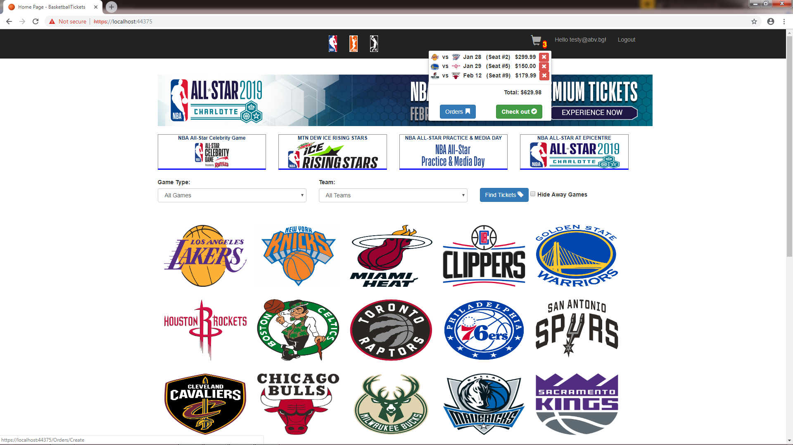
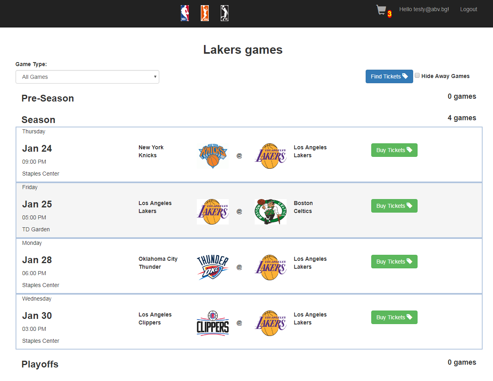
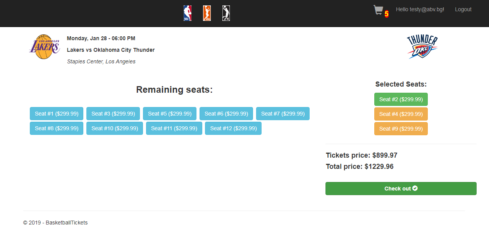
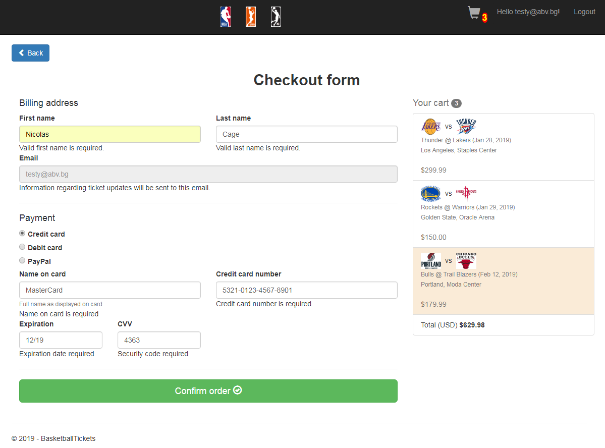
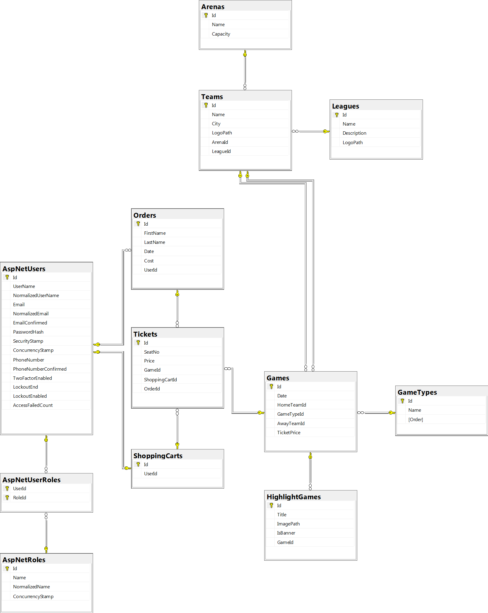

# Ticket Store

## Table of Contents

  - [Overview](#overview)
  - [Supported Entities](#supported-entities)
  - [Features](#features)
  - [Database Schema](#database-schema)
  - [Nice-to-Haves](#nice-to-haves)

## Overview

This project was created as part of a university assignment - an online e-commerce shop for sporting tickets.
Even though a lot of the implementation (even the Visual Studio project title itself) has references to the sport of basketball 
the backend and DB schema are generic enough for this project to be easily reused for other
types of sports.

## Supported Entities:

* Leagues
* Game Types
* Arenas
* Teams
* Games
* Highlight Games (Advertisements)
* Tickets
* Shopping Carts
* Orders
* Users
* User Roles

## Features

All entities, besides the identity-related ones (Users and User Roles), can be managed by a dedicated admin user.

As of right now, there is one admin user that's seeded and can be used.

Using an admin user, a user can customize the e-commerce shop from scratch - create/update/delete leagues, 
game types, games and etc., but most importantly he can create tickets for specific games, which can afterwards
be bought by normal users of the e-commerce shop.

Normal users can search for their favorite team's games, book tickets (add them to a shopping cart) and finaly confirm their orders. 

## Preview

### Home screen:

    

### List a specific team's games:

    

### Book tickets for a particular game:

    

### Finalize tickets order:

    

## Database Schema:

    

## Nice-to-Haves:

* Currently real payments are not supported - only a record of the order is made. Some sort of PayPal integration would be nice
* Sending confirmation emails for orders
* Internationalization of all project strings
* Tests
* General refactoring - this is a university project, so it's not written in the most clean way